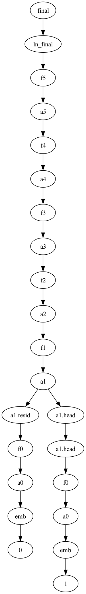

# nano-path-patching

Simple utilities for conduction **path patching**[^pp] (also known as **causal scrubbing**[^cs] and **interchange intervention**[^ii]) experiments on transformer language models. Written all in PyTorch, wrapping existing model implementations from HuggingFace.

For a more general and powerful implementation of path patching on *any* neural network, use Redwood Research's [rust_circuit](https://github.com/redwoodresearch/rust_circuit_public). The goals of this library are too make path patching experiments really easy to run on specific models, so you don't have to write down a whole circuit from scratch repeatedly (as you may have to with rust_circuit).

Currently under implementation.

## How to use

Basic idea: we rewrite the `model.forward()` call to support picking between multiple inputs based on the path we are on in the computational graph. We also offer utilities that allow splitting up computations within the graph dynamically, and maintain a cache so that complex path patching experiments aren't crazy slow.

First, set up the model:
```py
from gpt2 import create_gpt2, GPT2

config, tokenizer, gpt = create_gpt2(name="distilgpt2")
model = GPT2(config, gpt, verbose=False) # set to True for logs, inspecting cache accesses
```

Now, define your inputs.

```py
inputs = [
    tokenizer("The capital of Spain is", return_tensors="pt"),
    tokenizer("The capital of Italy is", return_tensors="pt")
]
```

Then, define two functions: `branch()` which tells the model when to branch apart computations and `which()`, which tells the model which input to select given a particular path in the computation graph.

In this example, I'll define `branch()` to split apart computation at attention layer `a1`, so that the model computes the residual stream and the attention separately. Then, in `which()` I'll make the model pass our counterfactual input if the path goes through `a1`, and our normal input otherwise.

```py
def branch(path):
    if path[-1] == "a1": return True
    return False

def which(path):
    if "a1" in path: return 1
    return 0
```

Finally, run the forward pass, passing these functions as args.

```py
res, cache = model(inputs, which, branch)
```

Final hidden states are stored in `res.hidden_states`.

You can visualise the resulting computation graph!

```py
dot = res.visualise_path()
dot.render('test.gv', view=True)
```



[^pp]: [Wang et al. (2022)](https://arxiv.org/abs/2211.00593), [Goldowsky-Dill et al. (2023)](https://arxiv.org/abs/2304.05969)
[^cs]: [Chan et al. (2022)](https://www.lesswrong.com/s/h95ayYYwMebGEYN5y)
[^ii]: [Geiger et al. (2021a)](https://arxiv.org/abs/2106.02997), [Geiger et al. (2021b)](https://arxiv.org/abs/2112.00826) (but I only consider inference-time intervention), [Geiger et al. (2023)](https://arxiv.org/abs/2301.04709)